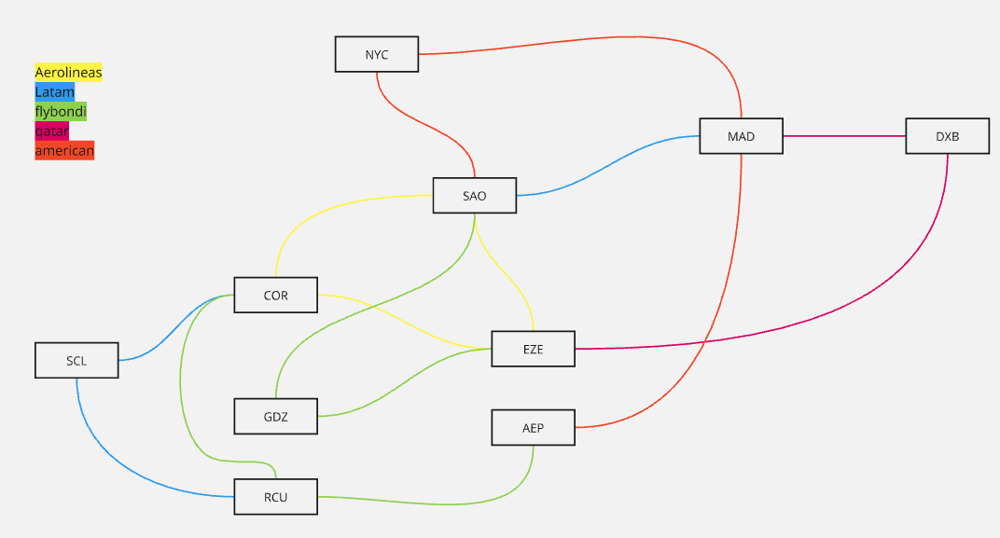

# Networks and Distributed System Final Project

## Assignment
### Distributed Ticket Sale System

A distributed ticket sale system allows users to purchase tickets to travel from destination A to B, potentially using combinations (connections) of services from different companies. Each company offers a set of services between various locations, each with a defined capacity (number of seats).

Additionally, each company operates its own node (server) that processes requests in the following form:

    getFreeSeats(serviceId)
    reserve(serviceId, seat_number)
    confirm_reserve(serviceId, seat_number)
    cancel_reserve(serviceId, seat_number)

The goal is to design and implement a system that prevents ticket overselling.

## Map of the air routes


## Steps to run the project

### Step 1:
Create a virtual environment:
```bash 
python3 -m venv env
```

### Step 2:
Activate the virtual environment:
```bash
source env/bin/activate
```

### Step 3:
Install the requirements:
```bash
pip install -r requirements.txt
```

### Step 4:
Run airline servers on different terminals to see the logs:
```bash
python3 run_airline_server.py -i resources/aerolineas_argentinas.json
python3 run_airline_server.py -i resources/latam_airlines.json
python3 run_airline_server.py -i resources/qatar_airways.json
python3 run_airline_server.py -i resources/american_airlines.json
python3 run_airline_server.py -i resources/flybondi.json
```

### Step 5:
Run ticket service servers on different terminals to see the logs:
```bash
python3 run_ticket_service_server.py -i resources/despegarcito1.json
python3 run_ticket_service_server.py -i resources/despegarcito2.json
python3 run_ticket_service_server.py -i resources/despegarcito3.json
python3 run_ticket_service_server.py -i resources/despegarcito4.json
```

### Step 6
Run the client (Default port servers ar running from 8001 to 8004):
```bash
python3 client.py -a localhost:<some_port>
```

## Other commands

### Generate protos
```bash
python -m grpc_tools.protoc -I protos/ --python_out=networking/ticket_service/ --pyi_out=networking/ticket_service --grpc_python_out=networking/ticket_service/ protos/ticket_service.proto

python -m grpc_tools.protoc -I protos/ --python_out=networking/airline/ --pyi_out=networking/airline/ --grpc_python_out=networking/airline protos/airline_service.proto
```

